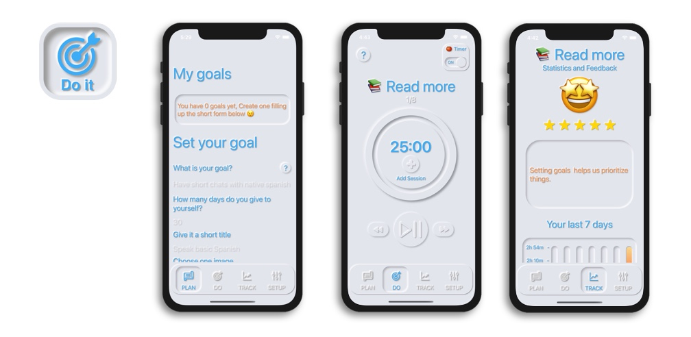

# Goal Achiever
App for achieve your life objectives with reminders and charts 

<!-- PROJECT LOGO -->
 

  

<!-- ABOUT THE PROJECT -->
## About The Project

This app helps you to stay consistent, keeping track of the time spent and giving feedbacks based on your expectations. Goal Achiever will keep reminding you with notifications when is the best time to work through your goals helping you to stay consistent on what matter you the most: your goal!

(<a href="#top">back to top</a>)

### Built With

* SwiftUI 2.0
* CoreData
* Google Analytics
* Firebase
* AdMob
* UserNotifications
* Combine
* StoreKit

(<a href="#top">back to top</a>)

<!-- Things I learned -->
## Things I learned

* Create Custom views on SwiftUI using a metamorphic design technique
* CoreData integration with SwiftUI
* Using the MVVC design pattern
* Implement the In-App Purchase API and create the store using Store-kit
* Differentiate the premium and free version of the app and linked with the store logic
* Implement Advertisment with AdMobs (banner and Interstials)
* Implement Google Analytics
* Working with the background and foreground to make the timer work
* Go through App review process (and counting for each updates)
* Implementation of StoreKit to ask a review from the user
* App Store Optimization (ASO)
* Usage of apple search ad

(<a href="#top">back to top</a>)

<!-- CONTRIBUTING -->
## Contributing

Contributions are what make the open source community such an amazing place to learn, inspire, and create. Any contributions you make are **greatly appreciated**.

If you have a suggestion that would make this better, please fork the repo and create a pull request. You can also simply open an issue with the tag "enhancement".
Don't forget to give the project a star! Thanks again!

1. Fork the Project
2. Create your Feature Branch (`git checkout -b feature/AmazingFeature`)
3. Commit your Changes (`git commit -m 'Add some AmazingFeature'`)
4. Push to the Branch (`git push origin feature/AmazingFeature`)
5. Open a Pull Request

(<a href="#top">back to top</a>)

<!-- Download on App Store -->
## Download on App Store

* [https://apps.apple.com/au/app/goal-achiever-focus-habit/id1537338218](https://apps.apple.com/au/app/goal-achiever-focus-habit/id1537338218)

(<a href="#top">back to top</a>)

